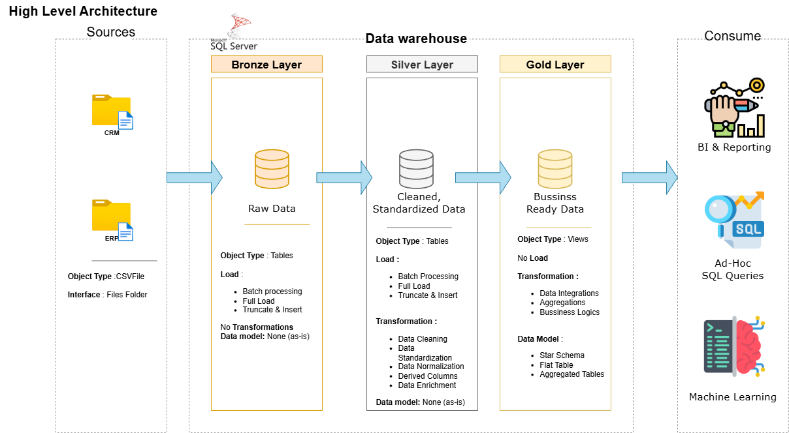

# 📊 SQL Data Warehouse Project

This project demonstrates an **end-to-end data warehouse and analytics solution** built using **SQL Server** and modern **data engineering best practices**.

The goal of this project is to transform raw ERP and CRM data into a **business-ready analytical model** that supports reporting and decision-making.

---

## 🏗️ Data Architecture

### 📐 Architecture Diagram

The project follows the **Medallion Architecture**:

### 🟤 Bronze Layer
- Raw data ingestion from CSV files
- Data stored as-is from ERP and CRM systems

### ⚪ Silver Layer
- Data cleansing and transformation
- Standardization and normalization
- Data quality handling

### 🟡 Gold Layer
- Business-ready data
- Star schema (Fact & Dimension tables)
- Optimized for analytics and reporting

---

## 📌 Project Objectives

- Build a modern **SQL-based data warehouse**
- Integrate multiple source systems
- Apply **ETL pipelines**
- Create analytical data models
- Generate insights using SQL queries

---

## 🛠️ Tools & Technologies

- SQL Server Express
- SQL Server Management Studio (SSMS)
- CSV datasets (ERP & CRM)
- Draw.io (Architecture & Data Models)
- Git & GitHub

---

## 📂 Repository Structure

data-warehouse-project/
│
├── datasets/                           # Raw datasets used for the project (ERP and CRM data)
│
├── docs/                               # Project documentation and architecture details
│   ├── etl.drawio                      # Draw.io file shows all different techniquies and methods of ETL
│   ├── data_architecture.drawio        # Draw.io file shows the project's architecture
│   ├── data_catalog.md                 # Catalog of datasets, including field descriptions and metadata
│   ├── data_flow.drawio                # Draw.io file for the data flow diagram
│   ├── data_models.drawio              # Draw.io file for data models (star schema)
│   ├── naming-conventions.md           # Consistent naming guidelines for tables, columns, and files
│
├── scripts/                            # SQL scripts for ETL and transformations
│   ├── bronze/                         # Scripts for extracting and loading raw data
│   ├── silver/                         # Scripts for cleaning and transforming data
│   ├── gold/                           # Scripts for creating analytical models
│
├── tests/                              # Test scripts and quality files
│
├── README.md                           # Project overview and instructions
├── LICENSE                             # License information for the repository
├── .gitignore                          # Files and directories to be ignored by Git
└── requirements.txt                    # Dependencies and requirements for the project
---

## 📊 Analytics & Insights

SQL-based analytics are created to analyze:

- Customer behavior
- Product performance
- Sales trends

These insights enable stakeholders to make **data-driven decisions**.

---

## 🧠 Skills Demonstrated

- SQL Development
- Data Warehousing
- ETL Pipeline Design
- Data Modeling (Star Schema)
- Data Analysis & Reporting

---

## 👤 About Me

Hi, I’m **Rupan raj** 👋  
An aspiring **Data Engineer / Data Analyst** with hands-on experience in SQL, data warehousing, and analytics projects.

🔗 GitHub: https://github.com/RahulRupan

