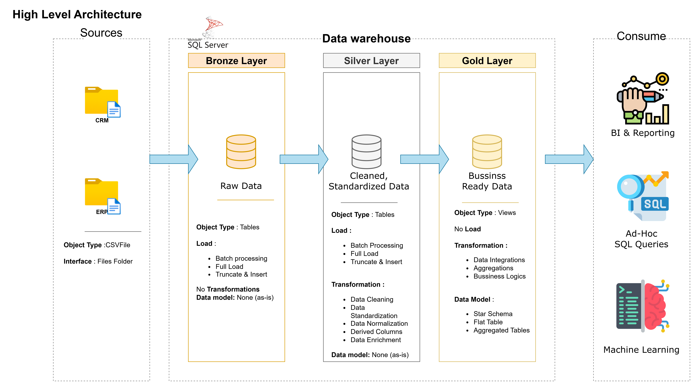

# 📊 Data Warehouse and Analytics Project

Welcome to the Data Warehouse and Analytics Project repository! 🚀  
This project demonstrates a comprehensive data warehousing and analytics solution, from building a data warehouse to generating actionable insights. Designed as a portfolio project, it highlights industry best practices in data engineering and analytics.

---

## 🏗️ Data Architecture

The data architecture for this project follows the **Medallion Architecture** using **Bronze, Silver, and Gold layers**.

### 🟤 Bronze Layer
- Stores raw data as-is from the source systems  
- Data is ingested from **CSV files** into a **SQL Server database**

### ⚪ Silver Layer
- Performs data cleansing, standardization, and normalization  
- Resolves data quality issues to prepare data for analysis

### 🟡 Gold Layer
- Houses business-ready data  
- Data is modeled into a **Star Schema** for reporting and analytics

---

### 📐 Architecture Diagram

---

## 📖 Project Overview

This project involves:

- **Data Architecture**: Designing a modern data warehouse using the Medallion Architecture  
- **ETL Pipelines**: Extracting, transforming, and loading data from source systems  
- **Data Modeling**: Developing fact and dimension tables optimized for analytical queries  
- **Analytics & Reporting**: Creating SQL-based reports and dashboards for actionable insights  

---

## 🎯 Skills Demonstrated

This repository is an excellent resource for showcasing expertise in:

- SQL Development  
- Data Architecture  
- Data Engineering  
- ETL Pipeline Development  
- Data Modeling  
- Data Analytics  

---

## 🛠️ Tools & Technologies

All tools used in this project are **free**:

- Datasets (CSV files)
- SQL Server Express
- SQL Server Management Studio (SSMS)
- Git & GitHub
- Draw.io
- Notion

---

## 🚀 Project Requirements

### Building the Data Warehouse (Data Engineering)

**Objective**  
Develop a modern data warehouse using SQL Server to consolidate sales data and enable analytical reporting.

**Specifications**
- Data Sources: ERP and CRM systems (CSV files)
- Data Quality: Clean and resolve data issues prior to analysis
- Integration: Combine multiple sources into a unified analytical model
- Scope: Latest dataset only (no historization)
- Documentation: Clear data model documentation for stakeholders

---

### BI: Analytics & Reporting (Data Analysis)

**Objective**  
Develop SQL-based analytics to deliver insights into:

- Customer Behavior  
- Product Performance  
- Sales Trends  

These insights empower stakeholders with key business metrics.

For more details, refer to `docs/requirements.md`.

---

---

## 🛡️ License

This project is licensed under the **MIT License**.

---

## 🌟 About Me

Hi! I’m **Rahul** 👋  
An aspiring **Data Engineer / Data Analyst** with hands-on experience in SQL, data warehousing, and analytics.

🔗 GitHub: https://github.com/RahulRupan

## 📂 Repository Structure

data-warehouse-project/
├── 📂 datasets/                # Raw CSV/JSON source data (ERP/CRM)
├── 📂 docs/                    # Technical Architecture & Lineage
│   ├── 🏛️ data_architecture.drawio # System design & cloud stack
│   ├── 🌟 data_models.drawio    # Star Schema / ER Diagrams
│   └── 📋 naming-conventions.md # Enterprise SQL standards
├── 📂 scripts/                 # Core ETL Logic
│   ├── 🥉 bronze/              # Extraction and Load scripts
│   ├── 🥈 silver/              # Data cleaning and joining
│   └── 🥇 gold/                # Business-ready analytical views
├── 📂 tests/                   # Data Quality Framework (Great Expectations/PyTest)
└── requirements.txt            # Environment dependencies

